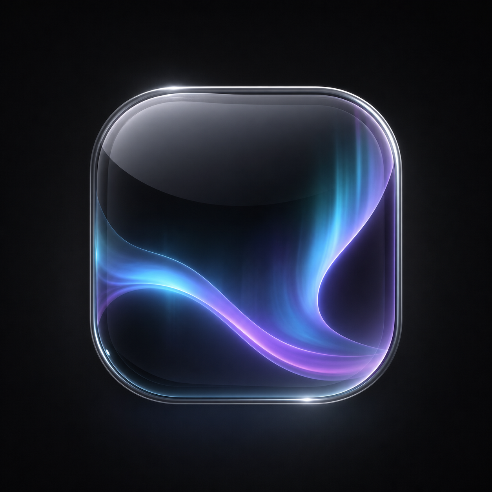
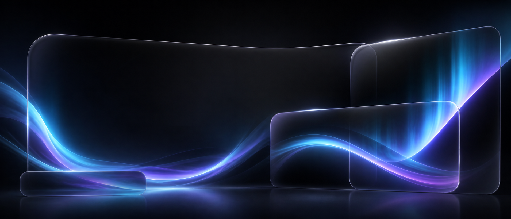
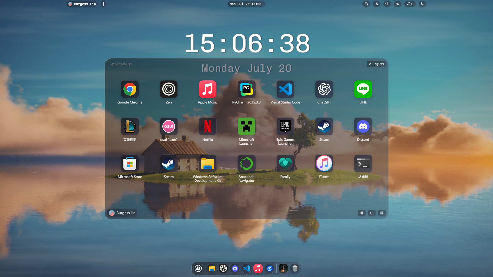
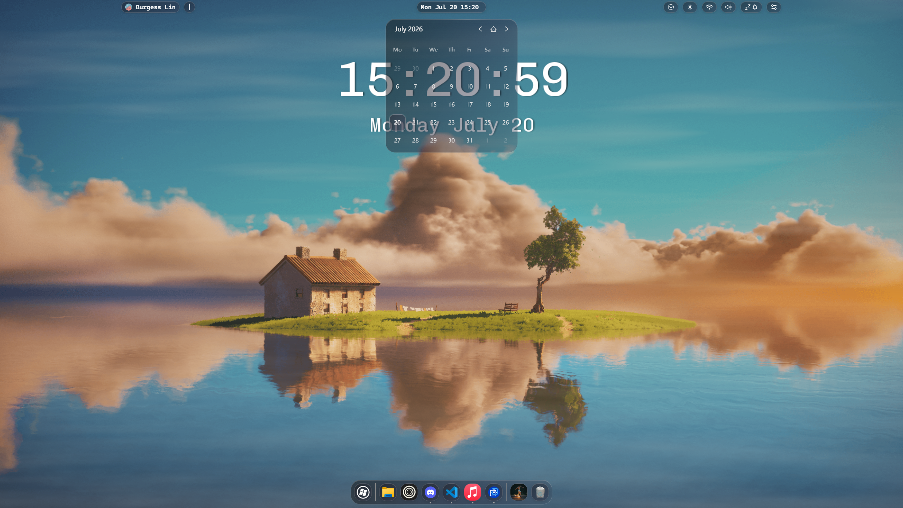

# Aurora Glass for Seelen UI

<p align="center">
  
</p>



Aurora Glass is an unofficial community theme for [Seelen UI](https://github.com/eythaann/seelen-ui). It gives the dock, toolbar, application launcher, and system popups a consistent translucent glass surface with fine silver borders and restrained motion.

Aurora Glass 是一款非官方 Seelen UI 社群主題，讓 Dock、工具欄、應用程式頁與系統彈出頁面使用一致的半透明玻璃、銀色細邊與動態效果。

## Screenshots

### Application launcher



### Calendar popup and dock



## Features

- Dock-style glass surfaces and bright hover states
- Compact toolbar with animated silver edge lighting
- Translucent application launcher with rounded corners
- Matching system tray, user, notification, network, calendar, Bluetooth, and media panels
- Aurora Glass power menu with responsive controls and restrained hover states
- Configurable blur, panel radius, tint, dock-wave timing, scale, and border cycle
- No dependency on another community theme

## Compatibility

- Seelen UI 2.8.0 or newer
- Windows 10 or Windows 11

The visual theme can be installed independently. Some application-launcher lifecycle and performance improvements shown in development builds belong to the Seelen UI application itself and are not included in this theme repository.

## Development installation

With Seelen UI running, clone this repository and load the theme directly:

```powershell
slu resource load theme .
```

Unload the development copy with:

```powershell
slu resource unload theme .
```

## Build a distributable theme

Run this command from the repository root:

```powershell
slu resource bundle theme .
```

Seelen UI will create a bundled YAML resource. Generated `bundle *.yml` files are intentionally excluded from source control; release or Marketplace uploads should be generated from a tagged source revision.

## Project structure

```text
assets/       Theme icon and banner
i18n/         Display name and description
shared/       Shared glass variables and popup styling
styles/       Widget-specific SCSS
metadata.yml  Seelen UI theme manifest
```

## License and attribution

Aurora Glass is released under the [GNU Affero General Public License v3.0](LICENSE). See [NOTICE.md](NOTICE.md) for the modification and upstream notices, and [CREDITS.md](CREDITS.md) for visual references.

Seelen UI is an upstream third-party project. This repository is not affiliated with, endorsed by, or an official release of Seelen Inc. No Seelen UI executable or installer is distributed here.

## Support and feedback

- [Report a bug or request a feature](https://github.com/burgess1202/aurora-glass-seelen-ui/issues)
- [Browse the source code](https://github.com/burgess1202/aurora-glass-seelen-ui)
